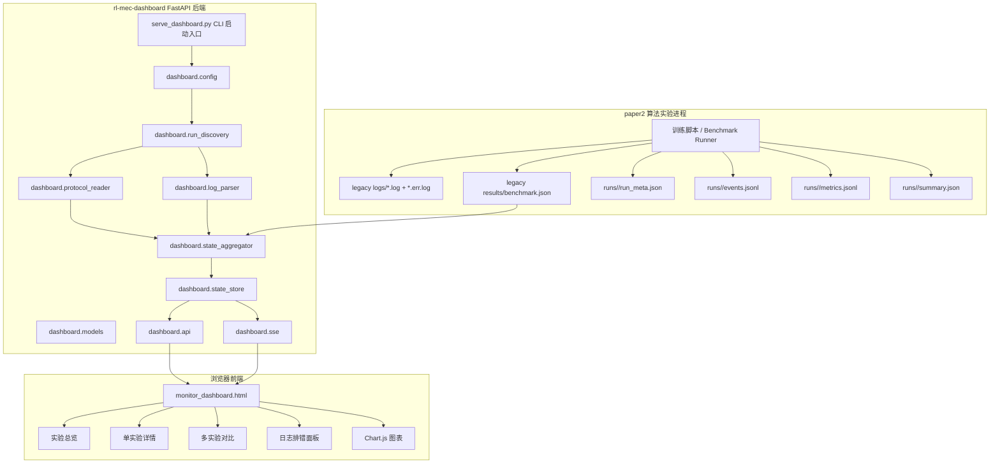
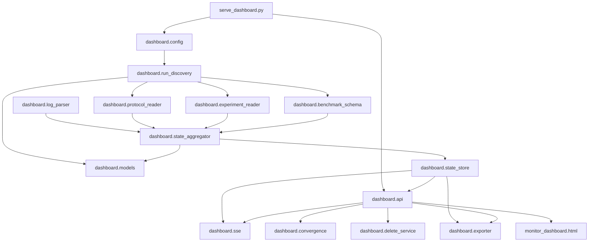

# 系统架构设计

## 元信息

- 项目名称：`rl-mec-dashboard`
- 目标项目：`w2030298-art/rl-mec-dashboard`
- 当前分支：`master`
- 生成日期：2026-04-28
- 路线：复杂路线，阶段 2 架构设计
- 设计目标：在不改动 GitHub 仓库的前提下，为本地手动添加 `docs/` 文档和后续 Codex 执行提供架构基线。
- 核心约束：
  - 保持只读看板，不提供启动/停止训练任务能力。
  - 允许修改 `paper2` 主项目的实验输出格式。
  - 第一轮不强制引入数据库。
  - 第一轮不迁移 React/Vite，保留单页前端，但拆分后端模块，规范 API 与数据协议。
  - 用户希望提升方向：实时监控更清楚、多实验对比更方便、日志排错更方便、页面交互和视觉更舒服。

---

## 1. 架构总览

当前项目已经具备 FastAPI 后端、SSE 实时推送、单文件 HTML 前端、Chart.js 图表、日志解析、`benchmark.json` 补全和 parser 单测基础。

本轮架构升级采用 **“结构化实验输出优先 + 日志解析 fallback + 后端模块化 + 轻量前端增强”** 的方案。

核心思路：

1. `paper2` 在训练过程中额外输出 dashboard 友好的结构化文件：
   - `run_meta.json`
   - `events.jsonl`
   - `metrics.jsonl`
   - `summary.json`
2. `rl-mec-dashboard` 优先读取结构化文件，降低对日志正则解析的依赖。
3. 旧日志解析能力保留为 fallback，兼容现有 `logs/*.log`、`logs/*.err.log` 和 `results/benchmark.json`。
4. 后端从单个 `serve_dashboard.py` 拆分为数据模型、协议读取、日志解析、状态聚合、API 路由、SSE 推送等模块。
5. 前端仍使用单页 HTML + CSS + JS + Chart.js，但内部代码按区域和职责重构为清晰的函数块，优先改善可用性而不是引入构建系统。
6. 暂不引入 SQLite。只有在历史 run 数量、查询维度和性能瓶颈达到阈值后，作为 P2 扩展。

### Mermaid 架构图



### Current module dependency graph

WEN-150 documentation note: `ref/architecture-brief.md` Linear reference maps to `docs/architecture.md`. This repo has no root `ref/` directory; implementation references live in `docs/references/`.



---

## 2. 模块划分

### 模块 A：配置与启动入口

- 目录：项目根目录、`dashboard/config.py`
- 职责：保留当前 `python serve_dashboard.py ...` 启动方式，同时将配置解析从业务逻辑中拆出。
- 输入：
  - CLI 参数：`--logs-dir`、`--benchmark-json`、`--runs-dir`、`--host`、`--port`、`--scan-interval`
  - 默认值：兼容当前 README 中的使用方式。
- 输出：
  - `DashboardConfig` 对象。
- 依赖：
  - Python 标准库：`argparse`、`pathlib`
  - `dashboard.models`

#### 核心类/接口

- `class DashboardConfig`
  - 字段：
    - `logs_dir: Path`
    - `benchmark_json: Path`
    - `runs_dir: Path | None`
    - `host: str`
    - `port: int`
    - `scan_interval_sec: float`
    - `stall_threshold_sec: int`
    - `recent_log_limit: int`
    - `sse_interval_sec: float`
- `parse_cli_args(argv: list[str] | None = None) -> DashboardConfig`
  - 从命令行解析配置。
- `create_default_config() -> DashboardConfig`
  - 提供测试和本地开发默认配置。

#### 设计决策

- `serve_dashboard.py` 继续存在，作为兼容入口。
- 新入口逻辑尽量薄，只负责：
  1. 解析 CLI。
  2. 创建 FastAPI app。
  3. 启动 uvicorn。
- 不在 `serve_dashboard.py` 中继续堆积 parser、state、API 逻辑。

---

### 模块 B：领域模型与 DTO

- 目录：`dashboard/models.py`
- 职责：统一后端内部状态模型、API 响应模型、结构化协议模型。
- 输入：
  - 日志解析结果
  - 结构化 JSON/JSONL 文件
  - `benchmark.json`
- 输出：
  - `RunState`
  - `RunSummary`
  - `AlgorithmResult`
  - `RecentLogEntry`
  - API DTO 字典
- 依赖：
  - Python 标准库：`dataclasses`、`typing`
  - 第一轮不引入 Pydantic，避免增加依赖；FastAPI 可以直接返回 dict/dataclass 转 dict 的结果。

#### 核心类/接口

- `@dataclass class AlgorithmResult`
  - 字段：
    - `algorithm: str`
    - `reward: float | None`
    - `reward_std: float | None`
    - `train_time: float | None`
    - `latency: float | None`
    - `energy: float | None`
    - `deadline_miss_rate: float | None`
    - `throughput: float | None`
    - `comm_score: float | None`
    - `update_count: int | None`
    - `environment: str`
    - `source: Literal["structured", "log", "benchmark_json", "historical"]`
    - `status: Literal["pending", "running", "finished", "failed", "historical"]`

- `@dataclass class RecentLogEntry`
  - 字段：
    - `time: str`
    - `level: Literal["debug", "info", "warn", "error"]`
    - `text: str`
    - `source_file: str`

- `@dataclass class RunMeta`
  - 字段：
    - `run_id: str`
    - `created_at: str`
    - `started_at: str | None`
    - `finished_at: str | None`
    - `status: str`
    - `environment: str`
    - `algorithms: list[str]`
    - `seeds: list[int]`
    - `config_hash: str`
    - `config_summary: dict[str, str | int | float | bool | None]`
    - `paper2_git_commit: str | None`

- `@dataclass class RunState`
  - 字段：
    - `run_id: str`
    - `status: Literal["idle", "running", "finished", "stalled", "degraded", "failed"]`
    - `current_algorithm: str`
    - `current_step: int`
    - `total_step: int`
    - `progress_pct: float`
    - `it_per_sec: float`
    - `eta_seconds: int`
    - `elapsed_seconds: int`
    - `update_count: int`
    - `completed_algorithms: list[str]`
    - `results: list[AlgorithmResult]`
    - `recent_logs: list[RecentLogEntry]`
    - `last_error: str`
    - `updated_at: float`
    - `process_alive: bool`
    - `overall_progress: float`
    - `total_algorithms: int`
    - `degraded: bool`
    - `stdout_file: str`
    - `stderr_file: str`
    - `has_structured_protocol: bool`

- `run_state_to_dict(state: RunState) -> dict`
  - 将 dataclass 转换为 FastAPI 可直接返回的 dict。
- `merge_algorithm_results(primary: list[AlgorithmResult], fallback: list[AlgorithmResult]) -> list[AlgorithmResult]`
  - 结构化数据优先，日志和历史 JSON 作为补全。

---

### 模块 C：结构化实验输出协议读取器

- 目录：`dashboard/protocol_reader.py`
- 职责：读取 `paper2` 新增输出协议，作为 dashboard 的首选数据源。
- 输入：
  - `runs/<run_id>/run_meta.json`
  - `runs/<run_id>/events.jsonl`
  - `runs/<run_id>/metrics.jsonl`
  - `runs/<run_id>/summary.json`
- 输出：
  - `RunMeta`
  - `AlgorithmResult`
  - `RecentLogEntry`
  - 当前训练进度事件
- 依赖：
  - `json`
  - `pathlib`
  - `dashboard.models`

#### 结构化协议定义

##### `run_meta.json`

```json
{
  "schema_version": 1,
  "run_id": "20260428_153000",
  "created_at": "2026-04-28T15:30:00+08:00",
  "started_at": "2026-04-28T15:30:03+08:00",
  "finished_at": null,
  "status": "running",
  "environment": "MEC-v1",
  "algorithms": ["GRPO", "PPO", "SAC"],
  "seeds": [0, 1, 2],
  "config_hash": "sha256-short",
  "config_summary": {
    "total_steps": 500000,
    "num_users": 20,
    "num_edges": 5
  },
  "paper2_git_commit": null
}
```

##### `events.jsonl`

每行一个 JSON object。

```json
{"time":"2026-04-28T15:31:00+08:00","type":"algorithm_started","algorithm":"GRPO","message":"Algorithm: GRPO"}
{"time":"2026-04-28T15:32:00+08:00","type":"progress","algorithm":"GRPO","current_step":12000,"total_step":500000,"it_per_sec":1020.5,"eta_seconds":478}
{"time":"2026-04-28T15:40:00+08:00","type":"algorithm_finished","algorithm":"GRPO","reward":11.83,"reward_std":1.01,"train_time":325.8}
{"time":"2026-04-28T15:41:00+08:00","type":"log","level":"warn","message":"High variance detected"}
{"time":"2026-04-28T15:42:00+08:00","type":"error","algorithm":"PPO","message":"unexpected keyword argument"}
```

##### `metrics.jsonl`

每行一个 JSON object，用于记录训练曲线和多指标。

```json
{"time":"2026-04-28T15:32:00+08:00","algorithm":"GRPO","step":1000,"reward":1.2,"latency":0.32,"energy":0.81,"deadline_miss_rate":0.02,"throughput":15.3,"comm_score":0.71}
```

##### `summary.json`

```json
{
  "schema_version": 1,
  "run_id": "20260428_153000",
  "status": "finished",
  "started_at": "2026-04-28T15:30:03+08:00",
  "finished_at": "2026-04-28T16:10:20+08:00",
  "results": [
    {
      "algorithm": "GRPO",
      "reward": 11.8355,
      "reward_std": 1.0085,
      "train_time": 325.8,
      "latency": 0.12,
      "energy": 0.45,
      "deadline_miss_rate": 0.03,
      "throughput": 18.2,
      "comm_score": 0.76,
      "update_count": 481436
    }
  ]
}
```

#### 核心类/接口

- `class StructuredRunReader`
  - `__init__(self, run_dir: Path)`
  - `exists(self) -> bool`
  - `read_meta(self) -> RunMeta | None`
  - `read_events_since(self, offset: int) -> tuple[list[dict], int]`
  - `read_metrics_tail(self, limit: int = 1000) -> list[dict]`
  - `read_summary(self) -> list[AlgorithmResult]`
  - `build_state_delta(self, previous_state: RunState) -> RunState`

#### 设计决策

- JSONL 采用 append-only，dashboard 增量读取。
- 文件格式不依赖数据库，便于 paper2 和 dashboard 解耦。
- dashboard 读取失败时，不中断服务，标记 `degraded=True` 并记录 `last_error`。
- 结构化协议文件存在时优先使用；不存在时回退到日志解析。

---

### 模块 D：Legacy 日志解析器

- 目录：`dashboard/log_parser.py`
- 职责：迁移当前 `serve_dashboard.py` 中的解析函数，兼容现有日志。
- 输入：
  - `logs/benchmark*.log`
  - `logs/benchmark*.err.log`
- 输出：
  - 算法切换事件
  - tqdm step 进度
  - ETA / elapsed
  - update_count
  - algorithm result
  - recent log entries
- 依赖：
  - `re`
  - `dashboard.models`

#### 核心函数

- `strip_log_prefix(line: str) -> str`
- `parse_step_from_tqdm(line: str) -> tuple[int, int, float] | None`
- `parse_elapsed_from_tqdm(line: str) -> float`
- `parse_eta_from_tqdm(line: str) -> int`
- `parse_algo_switch(line: str) -> str | None`
- `parse_result(line: str) -> AlgorithmResult | None`
- `parse_update_count(line: str) -> int | None`
- `parse_env_from_algo_header(line: str) -> str | None`
- `parse_benchmark_summary(line: str) -> bool`
- `parse_algorithm_count_from_summary(line: str) -> int | None`
- `classify_log_line(line: str) -> str | None`
- `parse_log_line(line: str) -> list[dict]`
  - 聚合以上函数，返回统一事件列表，供 state aggregator 使用。

#### 设计决策

- 现有单测迁移到 `tests/test_log_parser.py`。
- 保持正则行为尽量不变，避免破坏现有 dashboard 可用性。
- 新增边界测试：
  - ANSI 控制字符
  - Windows 路径
  - 空文件
  - 截断行
  - tqdm 无 total 的格式
  - baseline 算法名称含 `-` 的格式，例如 `Local-only`、`Full-offload`

---

### 模块 E：Run 发现与文件索引

- 目录：`dashboard/run_discovery.py`
- 职责：发现所有可展示 run，并为每个 run 建立数据源索引。
- 输入：
  - `logs_dir`
  - `runs_dir`
  - `benchmark_json`
- 输出：
  - `RunDescriptor` 列表
- 依赖：
  - `pathlib`
  - `dashboard.models`

#### 核心类/接口

- `@dataclass class RunDescriptor`
  - 字段：
    - `run_id: str`
    - `source_type: Literal["structured", "legacy_log", "mixed"]`
    - `run_dir: Path | None`
    - `stdout_file: Path | None`
    - `stderr_file: Path | None`
    - `summary_file: Path | None`
    - `meta_file: Path | None`
    - `mtime: float`
    - `display_name: str`

- `discover_structured_runs(runs_dir: Path) -> list[RunDescriptor]`
- `discover_legacy_runs(logs_dir: Path) -> list[RunDescriptor]`
- `discover_runs(config: DashboardConfig) -> list[RunDescriptor]`
- `select_latest_run(runs: list[RunDescriptor]) -> RunDescriptor | None`

#### 设计决策

- `runs_dir` 可选。
- 如果同一个 `run_id` 同时存在 structured 和 legacy log，标记为 `mixed`。
- structured 数据优先；legacy log 作为日志窗口和 fallback 指标来源。
- run 列表默认按 `mtime desc` 排序。

---

### 模块 F：状态聚合器

- 目录：`dashboard/state_aggregator.py`
- 职责：将结构化事件、legacy 日志、`benchmark.json` 合并为统一 `RunState`。
- 输入：
  - `RunDescriptor`
  - `StructuredRunReader`
  - `log_parser` 事件
  - `benchmark.json`
- 输出：
  - `RunState`
- 依赖：
  - `dashboard.models`
  - `dashboard.protocol_reader`
  - `dashboard.log_parser`

#### 核心类/接口

- `class RunStateAggregator`
  - `__init__(self, config: DashboardConfig)`
  - `initialize_state(self, descriptor: RunDescriptor) -> RunState`
  - `scan_once(self, descriptor: RunDescriptor, state: RunState) -> RunState`
  - `apply_structured_events(self, state: RunState, events: list[dict]) -> RunState`
  - `apply_legacy_log_events(self, state: RunState, events: list[dict]) -> RunState`
  - `load_benchmark_results(self, state: RunState) -> RunState`
  - `compute_status(self, state: RunState) -> RunState`
  - `compute_overall_progress(self, state: RunState) -> RunState`
  - `merge_results(self, state: RunState) -> RunState`

#### 状态判定规则

- `running`
  - 有 progress event，且最近更新时间小于 `stall_threshold_sec`。
- `finished`
  - structured `summary.json.status == "finished"`，或
  - legacy 日志检测到 benchmark 总结完成，或
  - 完成算法数大于等于总算法数。
- `stalled`
  - 有过训练进度，但超过 `stall_threshold_sec` 无更新。
- `degraded`
  - 解析失败、结构化协议文件损坏、部分数据不可用，但仍能返回部分状态。
- `failed`
  - 结构化 event 中出现 `type="error"` 且 run meta/summary 标记失败。
- `idle`
  - 未发现有效训练进度。

#### 设计决策

- `compute_status` 是唯一状态判定入口，避免散落在 API 或 parser 中。
- 所有异常转换为 `degraded` 或 `failed`，不让 API 直接 500。
- 聚合器不直接依赖 FastAPI，便于单元测试。

---

### 模块 G：内存状态存储与后台扫描

- 目录：`dashboard/state_store.py`
- 职责：管理所有 run 的内存状态、扫描 offset、后台刷新线程。
- 输入：
  - `DashboardConfig`
  - `RunDescriptor`
  - `RunStateAggregator`
- 输出：
  - API 可读取的最新 `RunState`
- 依赖：
  - `threading`
  - `time`
  - `dashboard.state_aggregator`

#### 核心类/接口

- `class DashboardStateStore`
  - `__init__(self, config: DashboardConfig, aggregator: RunStateAggregator)`
  - `refresh_run_index(self) -> list[RunDescriptor]`
  - `ensure_run_state(self, run_id: str) -> RunState`
  - `scan_all_once(self) -> None`
  - `start_background_scan(self) -> None`
  - `get_runs(self) -> list[RunSummary]`
  - `get_run_state(self, run_id: str) -> RunState | None`
  - `get_compare_payload(self, run_ids: list[str], metric: str) -> dict`
  - `shutdown(self) -> None`

#### 并发策略

- 使用 `threading.RLock` 保护 `_run_states`。
- API 读取时复制 dict 快照，避免前端读取过程中对象被扫描线程修改。
- 后台扫描间隔默认 1 秒。
- 每个 run 维护独立 offset：
  - legacy log offset
  - events.jsonl offset
  - metrics.jsonl offset

---

### 模块 H：FastAPI 应用与 REST API

- 目录：`dashboard/api.py`
- 职责：提供页面、run 列表、单 run 快照、多 run 对比、导出等 HTTP 接口。
- 输入：
  - 浏览器请求
  - `DashboardStateStore`
- 输出：
  - HTML
  - JSON
  - CSV / Markdown export
- 依赖：
  - FastAPI
  - `dashboard.state_store`
  - `dashboard.sse`

#### 核心函数

- `create_app(config: DashboardConfig) -> FastAPI`
  - 创建 app，注册路由，启动后台扫描。
- `register_routes(app: FastAPI, store: DashboardStateStore) -> None`
  - 集中注册所有 REST 和 SSE 路由。

#### API 定义

##### `GET /`

返回 `monitor_dashboard.html`。

##### `GET /api/health`

响应：

```json
{
  "status": "ok",
  "version": "0.2.0",
  "has_structured_protocol": true,
  "run_count": 12
}
```

##### `GET /api/runs`

响应：

```json
{
  "runs": [
    {
      "run_id": "20260428_153000",
      "display_name": "20260428_153000",
      "status": "running",
      "current_algorithm": "GRPO",
      "progress_pct": 32.5,
      "overall_progress": 5.3,
      "total_algorithms": 17,
      "updated_at": 1777383000.0,
      "source_type": "structured",
      "has_error": false,
      "last_error": ""
    }
  ]
}
```

##### `GET /api/runs/{run_id}`

返回完整 `RunState` 快照。

##### `GET /api/runs/{run_id}/events`

SSE 流。

事件：

```text
event: snapshot
data: {"run_id":"...","status":"running",...}
```

##### `GET /api/compare?run_ids=a,b,c&metric=reward`

响应：

```json
{
  "metric": "reward",
  "run_ids": ["a", "b", "c"],
  "algorithms": ["GRPO", "PPO"],
  "series": [
    {
      "algorithm": "GRPO",
      "values": [
        {"run_id": "a", "value": 11.8},
        {"run_id": "b", "value": 12.1}
      ]
    }
  ]
}
```

##### `GET /api/export/results.csv?run_ids=a,b,c`

响应：`text/csv`

CSV columns：

```text
run_id,algorithm,reward,reward_std,latency,energy,deadline_miss_rate,throughput,comm_score,train_time,update_count,status,source
```

##### `GET /api/export/results.md?run_ids=a,b,c`

响应：`text/markdown`

Markdown table columns：

```text
| Run | Algorithm | Reward | Latency | Energy | Deadline Miss | Throughput | Comm Score | Train Time | Status |
```

##### `POST /api/shutdown`

保留当前行为：关闭 dashboard 服务。

约束：

- 此接口只关闭 dashboard 后端，不控制训练任务。
- 前端按钮文案必须明确写为 `Stop Dashboard Server`，避免误解为停止实验。

---

### 模块 I：SSE 推送模块

- 目录：`dashboard/sse.py`
- 职责：封装 SSE snapshot 事件生成逻辑。
- 输入：
  - `run_id`
  - `DashboardStateStore`
  - `Request`
- 输出：
  - `StreamingResponse`
- 依赖：
  - FastAPI
  - `asyncio`
  - `json`

#### 核心函数

- `async def run_snapshot_event_generator(run_id: str, request: Request, store: DashboardStateStore, interval_sec: float) -> AsyncIterator[str]`
- `def create_sse_response(generator: AsyncIterator[str]) -> StreamingResponse`

#### 设计决策

- SSE 只推送当前 run 的状态快照。
- 多 run 总览仍采用 `GET /api/runs` 轮询，每 3 秒刷新即可，避免为总览页建立大量 SSE。
- 单 run 详情页使用 SSE，每 1 秒刷新。

---

### 模块 J：前端单页应用增强

- 文件：`monitor_dashboard.html`
- 职责：继续作为无构建前端入口，但内部进行结构化整理。
- 输入：
  - `/api/runs`
  - `/api/runs/{run_id}`
  - `/api/runs/{run_id}/events`
  - `/api/compare`
  - `/api/export/*`
- 输出：
  - 实验总览、详情、对比、日志、导出交互界面。
- 依赖：
  - 原生 HTML/CSS/JS
  - Chart.js CDN

#### 页面区域

1. `Header`
   - 项目标题
   - 当前连接状态
   - Dashboard Server 停止按钮

2. `Run Overview`
   - run 卡片或表格
   - 状态筛选：All / Running / Finished / Stalled / Degraded / Failed
   - 关键词筛选：run_id、algorithm、error text
   - 排序：更新时间、状态、完成度

3. `Run Detail`
   - 当前算法
   - 当前 step / total step
   - it/s、ETA、elapsed、update_count
   - overall progress
   - status badge

4. `Metrics Charts`
   - reward
   - latency
   - energy
   - deadline miss
   - throughput
   - comm score
   - training time

5. `Compare Panel`
   - 多选 run
   - 选择 metric
   - 算法横向柱状图
   - ranking table

6. `Results Table`
   - 支持排序
   - 支持只看 current run / historical / structured
   - 支持导出 CSV / Markdown

7. `Log Panel`
   - level 筛选：All / Error / Warn / Info
   - keyword filter
   - auto-scroll toggle
   - copy selected log line
   - error summary

#### 前端状态对象

```js
const dashboardState = {
  runs: [],
  currentRunId: null,
  currentRunState: null,
  selectedRunIds: [],
  selectedMetric: "reward",
  filters: {
    status: "all",
    keyword: "",
    logLevel: "all",
    logKeyword: "",
    autoScroll: true
  },
  charts: {
    rewardChart: null,
    timeChart: null,
    compareChart: null
  },
  sse: {
    eventSource: null,
    reconnectTimer: null,
    connected: false
  }
};
```

#### 前端核心函数

- `initDashboard()`
- `loadRuns()`
- `renderRunOverview(runs)`
- `applyRunFilters(runs)`
- `selectRun(runId)`
- `connectRunSSE(runId)`
- `disconnectRunSSE()`
- `fetchInitialRunState(runId)`
- `renderRunDetail(state)`
- `renderMetricCards(state)`
- `renderResultsTable(results)`
- `renderLogs(logs)`
- `updateCharts(state)`
- `loadCompareData()`
- `renderCompareChart(payload)`
- `exportResults(format)`
- `stopDashboardServer()`

#### 设计决策

- 第一轮不拆出多个 `.js` 文件，避免改变部署方式。
- 但必须用注释分区组织 JS：
  - `// State`
  - `// API Client`
  - `// Rendering`
  - `// Charts`
  - `// SSE`
  - `// Events`
- CSS 同样按页面区域分区。
- 所有前端新增功能必须保持无构建、双击启动脚本/命令行启动方式不变。

---

### 模块 K：导出模块

- 目录：`dashboard/exporter.py`
- 职责：将结果导出为 CSV 和 Markdown。
- 输入：
  - `RunState`
  - `AlgorithmResult`
- 输出：
  - CSV 字符串
  - Markdown 表格字符串
- 依赖：
  - `csv`
  - `io`

#### 核心函数

- `results_to_csv(states: list[RunState]) -> str`
- `results_to_markdown(states: list[RunState]) -> str`
- `normalize_result_row(run_id: str, result: AlgorithmResult) -> dict[str, str]`

#### 设计决策

- 第一轮不导出图片。
- 第一轮不生成完整论文报告，只导出可复制表格。
- 后续 P2 可新增 `report.md` 自动生成。

---

### 模块 L：paper2 输出协议适配

- 目录：`paper2` 主项目内建议新增或修改。
- 职责：在训练过程中输出 dashboard 友好的结构化文件。
- 输入：
  - 训练进度
  - 算法开始/结束事件
  - 指标结果
  - 异常信息
- 输出：
  - `runs/<run_id>/run_meta.json`
  - `runs/<run_id>/events.jsonl`
  - `runs/<run_id>/metrics.jsonl`
  - `runs/<run_id>/summary.json`

#### 建议接口

- `class DashboardRunWriter`
  - `__init__(self, run_dir: Path, run_id: str, config_summary: dict)`
  - `write_meta(self, meta: dict) -> None`
  - `append_event(self, event: dict) -> None`
  - `append_metric(self, metric: dict) -> None`
  - `write_summary(self, summary: dict) -> None`
  - `mark_finished(self) -> None`
  - `mark_failed(self, error: str) -> None`

#### 设计决策

- 这个模块属于 `paper2`，不是 dashboard 仓库强制内容。
- dashboard 必须兼容没有结构化协议的旧 run。
- Codex 实施时应先完成 dashboard 端读取和 fallback，再修改 paper2 输出端。

---

## 3. 数据流

### 3.1 Legacy 数据流

```text
paper2 benchmark
  -> logs/benchmark*.log
  -> logs/benchmark*.err.log
  -> results/benchmark.json
  -> dashboard.run_discovery.discover_legacy_runs()
  -> dashboard.log_parser.parse_log_line()
  -> dashboard.state_aggregator.apply_legacy_log_events()
  -> dashboard.state_aggregator.load_benchmark_results()
  -> DashboardStateStore
  -> GET /api/runs/{run_id}
  -> GET /api/runs/{run_id}/events
  -> monitor_dashboard.html
```

### 3.2 Structured 数据流

```text
paper2 benchmark
  -> runs/<run_id>/run_meta.json
  -> runs/<run_id>/events.jsonl
  -> runs/<run_id>/metrics.jsonl
  -> runs/<run_id>/summary.json
  -> dashboard.run_discovery.discover_structured_runs()
  -> dashboard.protocol_reader.StructuredRunReader
  -> dashboard.state_aggregator.apply_structured_events()
  -> DashboardStateStore
  -> REST API / SSE
  -> monitor_dashboard.html
```

### 3.3 API 数据流

```text
Browser
  -> GET /api/runs
  -> render run overview

Browser selects run
  -> GET /api/runs/{run_id}
  -> initial detail render
  -> GET /api/runs/{run_id}/events
  -> SSE snapshot updates

Browser selects compare runs
  -> GET /api/compare?run_ids=...&metric=...
  -> render compare chart

Browser exports
  -> GET /api/export/results.csv?run_ids=...
  -> download CSV
```

---

## 4. 关键接口定义

### 4.1 `RunState` API 响应字段

```json
{
  "run_id": "20260428_153000",
  "status": "running",
  "current_algorithm": "GRPO",
  "current_step": 12000,
  "total_step": 500000,
  "progress_pct": 2.4,
  "it_per_sec": 1020.5,
  "eta_seconds": 478,
  "elapsed_seconds": 60,
  "update_count": 11000,
  "completed_algorithms": ["PPO"],
  "results": [],
  "last_error": "",
  "updated_at": 1777383000.0,
  "process_alive": true,
  "recent_logs": [],
  "overall_progress": 1.024,
  "degraded": false,
  "total_algorithms": 17,
  "stderr_file": "logs/benchmark_full.err.log",
  "stdout_file": "logs/benchmark_full.log",
  "has_structured_protocol": true
}
```

### 4.2 `RunSummary` API 响应字段

```json
{
  "run_id": "20260428_153000",
  "display_name": "20260428_153000",
  "status": "running",
  "current_algorithm": "GRPO",
  "progress_pct": 2.4,
  "overall_progress": 1.024,
  "total_algorithms": 17,
  "updated_at": 1777383000.0,
  "source_type": "structured",
  "has_error": false,
  "last_error": ""
}
```

### 4.3 `AlgorithmResult` API 响应字段

```json
{
  "algorithm": "GRPO",
  "reward": 11.8355,
  "reward_std": 1.0085,
  "train_time": 325.8,
  "latency": 0.12,
  "energy": 0.45,
  "deadline_miss_rate": 0.03,
  "throughput": 18.2,
  "comm_score": 0.76,
  "update_count": 481436,
  "environment": "MEC-v1",
  "source": "structured",
  "status": "finished"
}
```

---

## 5. 技术实现映射

| 调研结论 | 架构映射 | 实现位置 |
|---|---|---|
| 保留 FastAPI + SSE | 继续使用 FastAPI app、SSE snapshot stream | `dashboard/api.py`, `dashboard/sse.py` |
| 保留轻量前端 | 不引入构建工具，继续维护 `monitor_dashboard.html` | `monitor_dashboard.html` |
| 结构化协议优先 | 新增 JSON/JSONL reader | `dashboard/protocol_reader.py` |
| 日志解析作为 fallback | 迁移现有正则解析器 | `dashboard/log_parser.py` |
| 后端模块化 | 拆出 models、discovery、aggregator、store、api | `dashboard/` package |
| 多实验对比 | 新增 compare API 与前端 compare panel | `dashboard/api.py`, `monitor_dashboard.html` |
| 日志排错增强 | recent logs 增强 level/keyword/source_file | `dashboard/log_parser.py`, `monitor_dashboard.html` |
| 结果导出 | CSV / Markdown export | `dashboard/exporter.py` |
| 暂不引入数据库 | 状态保留内存 + 文件扫描 | `dashboard/state_store.py` |
| 可测试性增强 | 聚合器和 parser 脱离 FastAPI | `tests/` |

---

## 6. 目录结构

建议改造后的目录结构如下：

```text
rl-mec-dashboard/
├── README.md
├── PLAN.md
├── serve_dashboard.py
├── monitor_dashboard.html
├── dashboard/
│   ├── __init__.py
│   ├── api.py
│   ├── config.py
│   ├── exporter.py
│   ├── log_parser.py
│   ├── models.py
│   ├── protocol_reader.py
│   ├── run_discovery.py
│   ├── sse.py
│   ├── state_aggregator.py
│   └── state_store.py
├── tests/
│   ├── __init__.py
│   ├── fixtures/
│   │   ├── legacy/
│   │   │   ├── benchmark_full.log
│   │   │   └── benchmark_full.err.log
│   │   └── structured/
│   │       └── run_001/
│   │           ├── run_meta.json
│   │           ├── events.jsonl
│   │           ├── metrics.jsonl
│   │           └── summary.json
│   ├── test_api.py
│   ├── test_exporter.py
│   ├── test_log_parser.py
│   ├── test_protocol_reader.py
│   ├── test_run_discovery.py
│   └── test_state_aggregator.py
└── docs/
    ├── research-report.md
    ├── architecture.md
    ├── plan.md
    ├── progress.md
    ├── issues.md
    ├── codex-dispatch.md
    └── references/
        └── ref-structured-experiment-protocol.md
```

### 兼容性要求

- `python serve_dashboard.py --logs-dir logs --benchmark-json results/benchmark.json --host 127.0.0.1 --port 8088` 必须继续可用。
- `monitor_dashboard.html` 仍由 `GET /` 返回。
- 旧的 `test_parsers.py` 可以迁移为 `tests/test_log_parser.py`，但迁移过程中要保持所有旧测试通过。
- 没有 `runs/` 结构化目录时，dashboard 仍能基于 legacy logs 工作。

---

## 7. 风险与应对

| 风险 | 影响 | 应对策略 |
|---|---|---|
| 结构化协议与 paper2 输出端未同步 | dashboard 读取不到新协议 | dashboard 必须保留 legacy fallback；先实现 reader 测试夹具，再修改 paper2 输出 |
| 后端一次性重构过大 | 容易破坏当前可运行状态 | 采用渐进拆分：先搬 parser 和 models，再引入 store/API，最后增强功能 |
| 单文件前端继续膨胀 | 可维护性下降 | 第一轮只做注释分区和函数归类；若后续超过约 1200 行 JS，再进入 React/Vite 迁移 |
| SSE 断线或多 run 订阅混乱 | 页面实时性下降 | 单详情页只保留一个 EventSource；切换 run 时必须先 close 旧连接 |
| 日志格式变化导致解析失败 | 状态 degraded 或结果缺失 | 结构化协议优先；parser 增加异常保护和 fixture 测试 |
| 大量历史 run 导致扫描变慢 | 前端响应慢、CPU 占用升高 | P1 先做 mtime cache；P2 再引入 SQLite |
| Stop Dashboard 被误解为停止训练 | 用户误操作预期错误 | 前端按钮改名为 `Stop Dashboard Server`，提示文案明确“不停止训练任务” |
| API 响应字段变更破坏前端 | 页面渲染错误 | 在 `models.py` 固化 DTO 字段；测试覆盖 `/api/runs` 和 `/api/runs/{run_id}` |
| Chart.js 数据为空时报错 | 页面白屏或 JS error | 所有 chart update 前检查空数据；空状态显示 placeholder |
| Windows 路径与编码问题 | 日志读取失败 | 所有路径用 `Path`；打开日志时使用 `encoding="utf-8", errors="replace"` |

---

## 8. 测试架构

### 单元测试

| 测试文件 | 覆盖内容 |
|---|---|
| `tests/test_log_parser.py` | 所有 legacy 日志解析函数 |
| `tests/test_protocol_reader.py` | `run_meta.json`、`events.jsonl`、`metrics.jsonl`、`summary.json` 读取 |
| `tests/test_run_discovery.py` | structured / legacy / mixed run 发现 |
| `tests/test_state_aggregator.py` | 状态转换、结果合并、degraded/failure 判定 |
| `tests/test_exporter.py` | CSV / Markdown 导出内容 |

### 集成测试

| 测试文件 | 覆盖内容 |
|---|---|
| `tests/test_api.py` | `GET /api/health`、`GET /api/runs`、`GET /api/runs/{run_id}`、export API |
| `tests/test_sse.py` | 可选，验证 event generator 输出 snapshot 格式 |

### 测试命令

```bash
python -m pytest -v
```

若保留旧测试文件，则也必须支持：

```bash
python -m pytest test_parsers.py -v
```

---

## 9. 分阶段落地建议

### 阶段 A：后端模块化，不改变功能

目标：保证行为与当前版本一致。

1. 新建 `dashboard/` package。
2. 迁移 `RunState` 到 `dashboard/models.py`。
3. 迁移 parser 函数到 `dashboard/log_parser.py`。
4. 迁移 run discovery 到 `dashboard/run_discovery.py`。
5. `serve_dashboard.py` 改为薄入口。
6. 所有旧 parser 测试通过。

### 阶段 B：结构化协议读取

目标：dashboard 可读取 `runs/<run_id>/` 协议文件。

1. 新建 `dashboard/protocol_reader.py`。
2. 新增 structured fixture。
3. 新增 `/api/health`。
4. `discover_runs()` 同时发现 structured 和 legacy。
5. 聚合器优先 structured，fallback legacy。

### 阶段 C：可用性增强

目标：让页面“更好用”。

1. 实验总览增强。
2. run 状态筛选。
3. 详情指标卡增强。
4. 日志过滤、错误高亮、auto-scroll 开关。
5. Stop Dashboard 文案修正。

### 阶段 D：多实验对比与导出

目标：支持论文实验分析。

1. `/api/compare`
2. compare chart
3. CSV export
4. Markdown export

### 阶段 E：paper2 输出端适配

目标：减少日志正则依赖。

1. 在 paper2 中实现 `DashboardRunWriter`。
2. benchmark runner 写出 `run_meta.json`。
3. 训练中 append `events.jsonl` 和 `metrics.jsonl`。
4. 训练结束写 `summary.json`。
5. dashboard 使用 structured 数据验证完整链路。

---

## 10. 架构验收标准

完成本轮架构实施后，必须满足：

- [ ] 原启动命令仍可运行。
- [ ] 没有 structured runs 时，legacy logs 仍能展示。
- [ ] 有 structured runs 时，dashboard 优先读取 JSON/JSONL。
- [ ] `/api/runs` 返回 run 总览列表。
- [ ] `/api/runs/{run_id}` 返回完整状态快照。
- [ ] `/api/runs/{run_id}/events` 每秒推送 snapshot。
- [ ] `/api/compare` 可对多个 run 的同一指标做对比。
- [ ] `/api/export/results.csv` 可导出 CSV。
- [ ] `/api/export/results.md` 可导出 Markdown 表格。
- [ ] 前端支持状态筛选、日志筛选、run 切换、对比和导出。
- [ ] Parser 单测、协议读取测试、聚合器测试、API 测试通过。
- [ ] Codex 执行时不需要再做技术选型，只需按 plan.md 实现。
